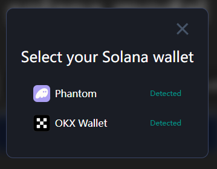
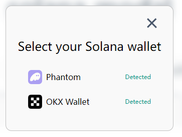

## solana modal
A modal connection tool based on the official Solana package, simple and easy to use.

### preview
dark

light


[demo](https://jianghong008.github.io/solana-modal/)

### Usage

```bash
$ npm install solana-modal
```
```typescript
import { SolanaModal } from 'solana-modal'
const modal = SolanaModal.init({
  rpc: 'https://api.devtnet.solana.com',
  autoConnect: true,
})

// connect
const address = await modal.openModal()
// event
modal.on('DISCONNECT', () => {
    console.log('disconnect')
})
```
Very simple, And the theme automatically follows the system.